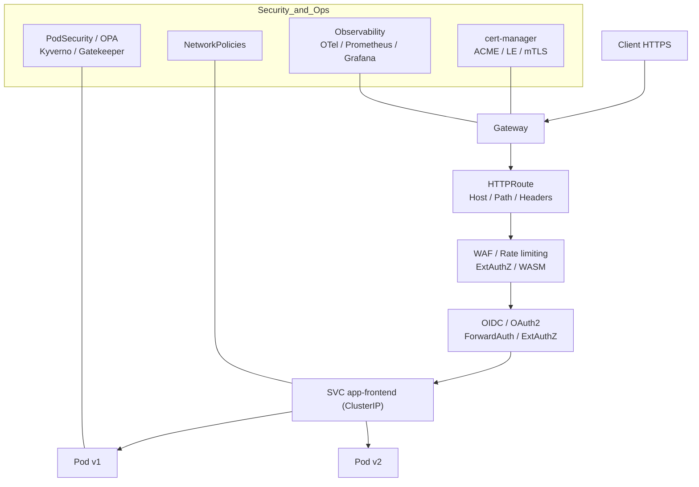

diagram of the art for k8s exposed to Internet

Bonjour Antonio ! Voici deux schémas “state-of-the-art” pour exposer un cluster Kubernetes sur Internet.

# Vue d’ensemble (Edge → Cluster)

```mermaid
flowchart LR
    A["Internet / Clients<br/>Browsers &bull; Mobile &bull; API"] --> B["DNS Anycast"]
    B --> C["CDN / WAF / DDoS<br/>Cloudflare / Akamai"]
    C --> D["Edge LB L7/L4<br/>Global ou Régional"]
    D --> E["Firewall / SecGroups"]
    E --> F["Public VIP / LB<br/>Cloud LB ou MetalLB/BGP"]
    F --> G["Workers Edge durcis<br/>Autoscale, no SSH"]
    G --> H["Ingress / Gateway<br/>Nginx / Envoy / Istio GW"]
    H --> I["TLS termination / mTLS<br/>cert-manager + ACME"]
    I --> J["Service Mesh<br/>Policies, mTLS, Rate limit"]
    J --> K["Services (ClusterIP)"]
    K --> L["Apps / Microservices<br/>Deployments / HPAs"]
    K --> M["Internal APIs / DBs<br/>Private Endpoints / VPC"]
```

**Notes clés**

* DNS géré + CDN/WAF/DDoS en amont (cache, filtrage, bot mgmt).
* LB public → nœuds workers “edge” durcis (no SSH, PSP/PSa, SecComp).
* Ingress **ou** Gateway API comme point d’entrée L7, certs via **cert-manager**.
* Mesh (mTLS, authZ, quotas) + **NetworkPolicies** (CNI: Cilium/Calico).
* Accès données via endpoints privés (pas d’expo DB publique).

# Flux L7 intra-cluster (Gateway API “state-of-the-art”)

**Bonnes pratiques rapides**

* **Gateway API** (Routes canari/blue-green, headers, weight).
* **ExtAuthZ** (Keycloak/IdP) au gateway, pas dans chaque app.
* **Ratelimiting** & **WAF** au bord (plugin/sidecar/EnvoyFilter).
* **mTLS partout** (mesh) + **HSTS/OCSP Stapling** côté edge.
* **ExternalDNS** pour auto-provision DNS, **cert-manager** pour TLS.
* **Cilium** (eBPF) pour NetPolicies/L7 policies + **Hubble** (visibilité).
* **Secrets** via KMS/CSI, **readOnlyRootFS**, **seccomp**, **runAsNonRoot**.

Si tu veux, je peux te générer les manifests “baseline” (Gateway, HTTPRoute, cert-manager, ExternalDNS) et une variante bare-metal (MetalLB + BGP).
