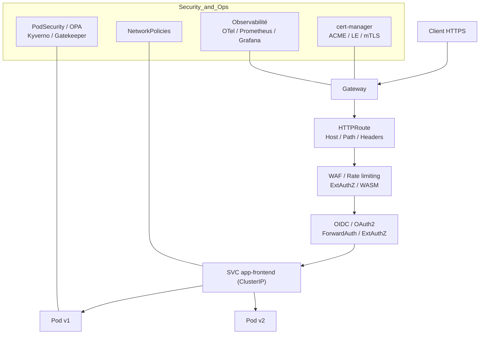

# Exposition d’un cluster Kubernetes sur Internet

Ce repo rassemble des schémas de référence **et** des manifestes prêts à l’emploi pour sécuriser l’exposition d’un cluster Kubernetes. Il couvre un chemin complet : DNS/Anycast → CDN/WAF → LB → Gateway API → cert-manager → mesh/NetPolicies, avec une variante bare-metal (MetalLB + BGP).

## Schémas d’architecture

### Vue d’ensemble (Edge → Cluster)


```mermaid
flowchart LR
    A["Internet / Clients<br/>Browsers &bull; Mobile &bull; API"] --> B["DNS Anycast"]
    B --> C["CDN / WAF / DDoS<br/>Cloudflare / Akamai"]
    C --> D["Edge LB L7/L4<br/>Global ou Régional"]
    D --> E["Firewall / SecGroups"]
    E --> F["Public VIP / LB<br/>Cloud LB ou MetalLB/BGP"]
    F --> G["Workers Edge durcis<br/>Autoscale, no SSH"]
    G --> H["Ingress / Gateway<br/>Nginx / Envoy / Istio GW"]
    H --> I["TLS termination / mTLS<br/>cert-manager + ACME"]
    I --> J["Service Mesh<br/>Policies, mTLS, Rate limit"]
    J --> K["Services (ClusterIP)"]
    K --> L["Apps / Microservices<br/>Deployments / HPAs"]
    K --> M["Internal APIs / DBs<br/>Private Endpoints / VPC"]
```

### Flux L7 intra-cluster (Gateway API)


```mermaid
flowchart TB
    ext["Client HTTPS"] --> gw["Gateway"]
    gw --> rt["HTTPRoute<br/>Host / Path / Headers"]
    rt --> waf["WAF / Rate limiting<br/>ExtAuthZ / WASM"]
    waf --> auth["OIDC / OAuth2<br/>ForwardAuth / ExtAuthZ"]
    auth --> svc["SVC app-frontend (ClusterIP)"]
    svc --> pod1["Pod v1"]
    svc --> pod2["Pod v2"]

    subgraph Security_and_Ops
      cm["cert-manager<br/>ACME / LE / mTLS"]
      np["NetworkPolicies"]
      ps["PodSecurity / OPA<br/>Kyverno / Gatekeeper"]
      obs["Observabilité<br/>OTel / Prometheus / Grafana"]
    end

    cm --- gw
    np --- svc
    ps --- pod1
    obs --- gw
```

## Manifests fournis

```
manifests/
├── baseline/
│   ├── 00-namespaces.yaml         # Namespaces dédiés (gateway, cert-manager, external-dns)
│   ├── gateway/                   # GatewayClass/Gateway + HTTPRoute canari
│   ├── cert-manager/              # ClusterIssuer ACME + certificat wildcard
│   └── external-dns/              # Déploiement ExternalDNS compatible Gateway API
└── bare-metal/
    └── metallb/                   # Pool IP + L2/BGP pour exposition bare-metal
```

### Gateway API (baseline)
* **GatewayClass + Gateway** pour un listener HTTPS + redirection HTTP→HTTPS.
* **HTTPRoute** avec réécriture d’URL, headers additionnels et traffic splitting (90/10) pour les déploiements blue/green ou canari.

### cert-manager
* **ClusterIssuer ACME** (Cloudflare DNS01) prêt à l’emploi.
* **Certificate wildcard** pour `example.com` et `*.example.com` utilisé par le Gateway.

### ExternalDNS
* RBAC minimal pour récupérer services/ingresses/HTTPRoutes.
* Déploiement configuré pour Cloudflare avec `--registry=txt` et `--txt-owner-id=edge-gateway`.

### Variante bare-metal (MetalLB)
* **IPAddressPool + L2Advertisement** pour annoncer un bloc IP public.
* **BGPPeer + BGPAdvertisement** pour intégrer un routeur edge (ASN privés d’exemple).

## Comment utiliser

1. **Pré-requis** : cluster >= 1.28 avec CRDs Gateway API, cert-manager et MetalLB (si bare-metal) déjà installés.
2. Adaptez les valeurs `example.com`, les adresses IP et les secrets (`cloudflare-api-token`, `metallb-bgp-password`).
3. Appliquez les namespaces et la Gateway baseline :

   ```bash
   kubectl apply -f manifests/baseline/00-namespaces.yaml
   kubectl apply -f manifests/baseline/cert-manager/
   kubectl apply -f manifests/baseline/gateway/
   kubectl apply -f manifests/baseline/external-dns/
   ```

4. Pour le bare-metal, configurez MetalLB :

   ```bash
   kubectl apply -f manifests/bare-metal/metallb/
   ```

5. Connectez vos services applicatifs : créez un `Service` (ClusterIP) nommé `app-frontend` et, si besoin, `app-frontend-v2` dans le namespace `edge-gateway` pour profiter du traffic-splitting.

## Bonnes pratiques rapides

* CDN/WAF/DDoS en amont + LB public vers nœuds edge durcis (no SSH, SecComp/PSa).
* Gateway API comme point d’entrée L7 ; cert-manager pour TLS automatisé (ACME/LE ou autre PKI).
* AuthN/AuthZ centralisées (ExtAuthZ, OIDC) au niveau du gateway ou du mesh.
* mTLS mesh + **NetworkPolicies** (Cilium/Calico) et observabilité (OTel/Prom/Grafana).
* Secrets via KMS/CSI, `readOnlyRootFS`, `runAsNonRoot`, `seccompProfile` et quotas.
